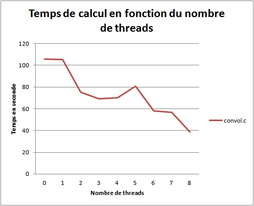

# OpenMP
## TP3 parallélisme 2017
### Prérequis
#### Compiler avec MPI
```mpicc ```[fichier]```.c -o ```[programme compilé]``` -lm -fopenmp```
#### Lancer le programme compilé
```./```[programme compilé]
### Question 1
#### **(Nombre de coeurs disponibles)** Vérifier à l'aide de la commande ```cat /proc/cpuinfo```, le nombre de coeurs disponibles sur votre machine
2 * 4 = 8 coeurs
### Question 2
#### **(Premier programme)** Utiliser un des programmes du cours pour tester votre environnement. N'oubliez pas de positionner la variable OMP_NUM_THREADS !
**mandel.c**
```C
/*
 * Programmation Parallèle - Avril 2012
 * Polytech'Paris
 * Université Pierre et Marie Curie
 * Calcul de l'ensemble de Mandelbrot, Version séquentielle
 */

#include <stdlib.h>
#include <stdio.h>
#include <time.h>	/* chronometrage */
#include <string.h>     /* pour memset */
#include <math.h>
#include <sys/time.h>
#include <omp.h>

#include "rasterfile.h"

char info[] = "\
Usage:\n\
      mandel dimx dimy xmin ymin xmax ymax prof\n\
\n\
      dimx,dimy : dimensions de l'image a generer\n\
      xmin,ymin,xmax,ymax : domaine a calculer dans le plan complexe\n\
      prof : nombre maximale d'iteration\n\
\n\
Quelques exemples d'execution\n\
      mandel 800 800 0.35 0.355 0.353 0.358 200\n\
      mandel 800 800 -0.736 -0.184 -0.735 -0.183 500\n\
      mandel 800 800 -0.736 -0.184 -0.735 -0.183 300\n\
      mandel 800 800 -1.48478 0.00006 -1.48440 0.00044 100\n\
      mandel 800 800 -1.5 -0.1 -1.3 0.1 10000\n\
";

double my_gettimeofday(){
	struct timeval tmp_time;
	gettimeofday(&tmp_time, NULL);
	return tmp_time.tv_sec + (tmp_time.tv_usec * 1.0e-6L);
}

/**
 * Convertion entier (4 octets) LINUX en un entier SUN
 * @param i entier à convertir
 * @return entier converti
 */

int swap(int i) {
	int init = i;
	int conv;
	unsigned char *o, *d;

	o = ( (unsigned char *) &init) + 3;
	d = (unsigned char *) &conv;

	*d++ = *o--;
	*d++ = *o--;
	*d++ = *o--;
	*d++ = *o--;

	return conv;
}

/***
 * Par Francois-Xavier MOREL (M2 SAR, oct2009):
 */

unsigned char power_composante(int i, int p) {
	unsigned char o;
	double iD=(double) i;

	iD/=255.0;
	iD=pow(iD,p);
	iD*=255;
	o=(unsigned char) iD;
	return o;
}

unsigned char cos_composante(int i, double freq) {
	unsigned char o;
	double iD=(double) i;
	iD=cos(iD/255.0*2*M_PI*freq);
	iD+=1;
	iD*=128;

	o=(unsigned char) iD;
	return o;
}

/***
 * Choix du coloriage : definir une (et une seule) des constantes
 * ci-dessous :  
 */
//#define ORIGINAL_COLOR
#define COS_COLOR

#ifdef ORIGINAL_COLOR
#define COMPOSANTE_ROUGE(i)    ((i)/2)
#define COMPOSANTE_VERT(i)     ((i)%190)
#define COMPOSANTE_BLEU(i)     (((i)%120) * 2)
#endif /* #ifdef ORIGINAL_COLOR */
#ifdef COS_COLOR
#define COMPOSANTE_ROUGE(i)    cos_composante(i,13.0)
#define COMPOSANTE_VERT(i)     cos_composante(i,5.0)
#define COMPOSANTE_BLEU(i)     cos_composante(i+10,7.0)
#endif /* #ifdef COS_COLOR */

/**
 *  Sauvegarde le tableau de données au format rasterfile
 *  8 bits avec une palette de 256 niveaux de gris du blanc (valeur 0)
 *  vers le noir (255)
 *    @param nom Nom de l'image
 *    @param largeur largeur de l'image
 *    @param hauteur hauteur de l'image
 *    @param p pointeur vers tampon contenant l'image
 */

void sauver_rasterfile( char *nom, int largeur, int hauteur, unsigned char *p) {
	FILE *fd;
	struct rasterfile file;
	int i;
	unsigned char o;

	if ( (fd=fopen(nom, "w")) == NULL ) {
		printf("erreur dans la creation du fichier %s \n",nom);
		exit(1);
	}

	file.ras_magic  = swap(RAS_MAGIC);
	file.ras_width  = swap(largeur);	  /* largeur en pixels de l'image */
	file.ras_height = swap(hauteur);         /* hauteur en pixels de l'image */
	file.ras_depth  = swap(8);	          /* profondeur de chaque pixel (1, 8 ou 24 )   */
	file.ras_length = swap(largeur*hauteur); /* taille de l'image en nb de bytes		*/
	file.ras_type    = swap(RT_STANDARD);	  /* type de fichier */
	file.ras_maptype = swap(RMT_EQUAL_RGB);
	file.ras_maplength = swap(256*3);

	fwrite(&file, sizeof(struct rasterfile), 1, fd);

	/* Palette de couleurs : composante rouge */
	i = 256;
	while( i--) {
	o = COMPOSANTE_ROUGE(i);
	fwrite( &o, sizeof(unsigned char), 1, fd);
	}

	/* Palette de couleurs : composante verte */
	i = 256;
	while( i--) {
	o = COMPOSANTE_VERT(i);
	fwrite( &o, sizeof(unsigned char), 1, fd);
	}

	/* Palette de couleurs : composante bleu */
	i = 256;
	while( i--) {
	o = COMPOSANTE_BLEU(i);
	fwrite( &o, sizeof(unsigned char), 1, fd);
	}

	// pour verifier l'ordre des lignes dans l'image :
	//fwrite( p, largeur*hauteur/3, sizeof(unsigned char), fd);

	// pour voir la couleur du '0' :
	// memset (p, 0, largeur*hauteur);

	fwrite( p, largeur*hauteur, sizeof(unsigned char), fd);
	fclose( fd);
}

/**
 * Étant donnée les coordonnées d'un point \f$c=a+ib\f$ dans le plan
 * complexe, la fonction retourne la couleur correspondante estimant
 * à quelle distance de l'ensemble de mandelbrot le point est.
 * Soit la suite complexe défini par:
 * \f[
 * \left\{\begin{array}{l}
 * z_0 = 0 \\
 * z_{n+1} = z_n^2 - c
 * \end{array}\right.
 * \f]
 * le nombre d'itérations que la suite met pour diverger est le
 * nombre \f$ n \f$ pour lequel \f$ |z_n| > 2 \f$.
 * Ce nombre est ramené à une valeur entre 0 et 255 correspond ainsi a
 * une couleur dans la palette des couleurs.
 */

unsigned char xy2color(double a, double b, int prof) {
	double x, y, temp, x2, y2;
	int i;

	x = y = 0.;
	for( i=0; i<prof; i++) {
		/* garder la valeur précédente de x qui va etre ecrase */
		temp = x;
		/* nouvelles valeurs de x et y */
		x2 = x*x;
		y2 = y*y;
		x = x2 - y2 + a;
		y = 2*temp*y + b;
		if( x2 + y2 >= 4.0) break;
	}
	return (i==prof)?255:(int)((i%255));
}

/*
 * Partie principale: en chaque point de la grille, appliquer xy2color
 */

int main(int argc, char *argv[]) {
	/* Domaine de calcul dans le plan complexe */
	double xmin, ymin;
	double xmax, ymax;
	/* Dimension de l'image */
	int w,h;
	/* Pas d'incrementation */
	double xinc, yinc;
	/* Profondeur d'iteration */
	int prof;
	/* Image resultat */
	unsigned char	*ima, *pima;
	/* Variables intermediaires */
	int  i, j;
	double x, y;
	/* Chronometrage */
	double debut, fin;

	int nb_proc;

	/* debut du chronometrage */
	debut = my_gettimeofday();


	if( argc == 1) fprintf( stderr, "%s\n", info);

	/* Valeurs par defaut de la fractale */
	xmin = -2; ymin = -2;
	xmax =  2; ymax =  2;
	w = h = 800;
	prof = 10000;
	nb_proc = 1;

	/* Recuperation des parametres */
	if( argc > 1) nb_proc    = atoi(argv[1]);
	if( argc > 2) w    = atoi(argv[2]);
	if( argc > 3) h    = atoi(argv[3]);
	if( argc > 4) xmin = atof(argv[4]);
	if( argc > 5) ymin = atof(argv[5]);
	if( argc > 6) xmax = atof(argv[6]);
	if( argc > 7) ymax = atof(argv[7]);
	if( argc > 8) prof = atoi(argv[8]);

	/* Calcul des pas d'incrementation */
	xinc = (xmax - xmin) / (w-1);
	yinc = (ymax - ymin) / (h-1);

	/* affichage parametres pour verificatrion */
	fprintf( stderr, "Domaine: {[%lg,%lg]x[%lg,%lg]}\n", xmin, ymin, xmax, ymax);
	fprintf( stderr, "Increment : %lg %lg\n", xinc, yinc);
	fprintf( stderr, "Prof: %d\n",  prof);
	fprintf( stderr, "Dim image: %dx%d\n", w, h);

	/* Allocation memoire du tableau resultat */  
	pima = ima = (unsigned char *)malloc( w*h*sizeof(unsigned char));

	if( ima == NULL) {
		fprintf( stderr, "Erreur allocation mémoire du tableau \n");
		return 0;
	}

	omp_set_num_threads(nb_proc);

	#pragma omp parallel {
		/* Traitement de la grille point par point */
		y = ymin;
		#pragma omp for private(j,pima,x,y) schedule (runtime)
		for (i = 0; i < h; i++) {
			y = ymin + i * yinc;
			pima = &ima[i*w];
			x = xmin;
			for (j = 0; j < w; j++) {
				// printf("%d\n", xy2color( x, y, prof));
				// printf("(x,y)=(%g;%g)\t (i,j)=(%d,%d)\n", x, y, i, j);
				*pima++ = xy2color( x, y, prof);
				x += xinc;
			}
			y += yinc;
		}
	}

	/* fin du chronometrage */
	fin = my_gettimeofday();
	fprintf( stderr, "Temps total de calcul : %g sec\n",
	fin - debut);
	fprintf( stdout, "%g\n", fin - debut);

	/* Sauvegarde de la grille dans le fichier resultat "mandel.ras" */
	sauver_rasterfile( "mandel.ras", w, h, ima);

	return 0;
}
```
**convol.c**
```C
/*
 * Programmation Parallèle - Mars 2017
 * ENSG (Ecole nationale des siences géographiques)
 * Calcul de convolution sur une image.
 * By Ahmad AUDI (IGN/DRE/LaSTIG/LOEMI)
 */


#include <stdio.h>
#include <stdlib.h>
#include <math.h>   /* pour le rint */
#include <string.h> /* pour le memcpy */
#include <time.h>   /* chronometrage */
#include <omp.h>

#include "rasterfile.h"

#define MAX(a,b) ((a>b) ? a : b)

/**
 * \struct Raster
 * Structure décrivant une image au format Sun Raster
 */

typedef struct {
	struct rasterfile file;  ///< Entête image Sun Raster
	unsigned char rouge[256],vert[256],bleu[256];  ///< Palette de couleur
	unsigned char *data;    ///< Pointeur vers l'image
} Raster;

double my_gettimeofday(){
	struct timeval tmp_time;
	gettimeofday(&tmp_time, NULL);
	return tmp_time.tv_sec + (tmp_time.tv_usec * 1.0e-6L);
}

/**
 * Cette procedure convertit un entier LINUX en un entier SUN
 *
 * \param i pointeur vers l'entier à convertir
 */

void swap(int *i) {
	unsigned char s[4],*n;
	memcpy(s,i,4);
	n=(unsigned char *)i;
	n[0]=s[3];
	n[1]=s[2];
	n[2]=s[1];
	n[3]=s[0];
}

/**
 * \brief Lecture d'une image au format Sun RASTERFILE.
 *
 * Au retour de cette fonction, la structure r est remplie
 * avec les données liée à l'image. Le champ r.file contient
 * les informations de l'entete de l'image (dimension, codage, etc).
 * Le champ r.data est un pointeur, alloué par la fonction
 * lire_rasterfile() et qui contient l'image. Cette espace doit
 * être libéré après usage.
 *
 * \param nom nom du fichier image
 * \param r structure Raster qui contient l'image
 *  chargée en mémoire
 */

void lire_rasterfile(char *nom, Raster *r) {
	FILE *f;
	int i;

	if( (f=fopen( nom, "r"))==NULL) {
		fprintf(stderr,"erreur a la lecture du fichier %s\n", nom);
		exit(1);
	}
	fread( &(r->file), sizeof(struct rasterfile), 1, f);    
	swap(&(r->file.ras_magic));
	swap(&(r->file.ras_width));
	swap(&(r->file.ras_height));
	swap(&(r->file.ras_depth));
	swap(&(r->file.ras_length));
	swap(&(r->file.ras_type));
	swap(&(r->file.ras_maptype));
	swap(&(r->file.ras_maplength));

	if ((r->file.ras_depth != 8) ||  (r->file.ras_type != RT_STANDARD) ||
		(r->file.ras_maptype != RMT_EQUAL_RGB)) {
		fprintf(stderr,"palette non adaptee\n");
		exit(1);
	}

	/* composante de la palette */
	fread(&(r->rouge),r->file.ras_maplength/3,1,f);
	fread(&(r->vert), r->file.ras_maplength/3,1,f);
	fread(&(r->bleu), r->file.ras_maplength/3,1,f);

	if ((r->data=malloc(r->file.ras_width*r->file.ras_height))==NULL){
		fprintf(stderr,"erreur allocation memoire\n");
		exit(1);
	}
	fread(r->data,r->file.ras_width*r->file.ras_height,1,f);
	fclose(f);
}

/**
 * Sauve une image au format Sun Rasterfile
 */

void sauve_rasterfile(char *nom, Raster *r)     {
	FILE *f;
	int i;

	if( (f=fopen( nom, "w"))==NULL) {
		fprintf(stderr,"erreur a l'ecriture du fichier %s\n", nom);
		exit(1);
	}

	swap(&(r->file.ras_magic));
	swap(&(r->file.ras_width));
	swap(&(r->file.ras_height));
	swap(&(r->file.ras_depth));
	swap(&(r->file.ras_length));
	swap(&(r->file.ras_type));
	swap(&(r->file.ras_maptype));
	swap(&(r->file.ras_maplength));

	fwrite(&(r->file),sizeof(struct rasterfile),1,f);
	/* composante de la palette */
	fwrite(&(r->rouge),256,1,f);
	fwrite(&(r->vert),256,1,f);
	fwrite(&(r->bleu),256,1,f);
	/* pour le reconvertir pour la taille de l'image */
	swap(&(r->file.ras_width));
	swap(&(r->file.ras_height));
	fwrite(r->data,r->file.ras_width*r->file.ras_height,1,f);
	fclose(f);
}

/**
 * Réalise une division d'entiers plus précise que
 * l'opérateur '/'.
 * Remarque : la fonction rint provient de la librairie
 * mathématique.
 */

unsigned char division(int numerateur,int denominateur) {
	if (denominateur != 0)
	return (unsigned char) rint((double)numerateur/(double)denominateur);
	else
	return 0;
}

static int ordre( unsigned char *a, unsigned char *b) {
	return (*a-*b);
}


typedef enum {
	CONVOL_MOYENNE1, ///< Filtre moyenneur
	CONVOL_MOYENNE2, ///< Filtre moyenneur central
	CONVOL_CONTOUR1, ///< Laplacien
	CONVOL_CONTOUR2, ///< Max gradient
	CONVOL_MEDIAN    ///< Filtre médian
} filtre_t;

/**
 * Réalise une opération de convolution avec un noyau prédéfini sur
 * un point.
 *
 * \param choix type de noyau pour la convolution :
 *  - CONVOL_MOYENNE1 : filtre moyenneur
 *  - CONVOL_MOYENNE2 : filtre moyenneur avec un poid central plus fort
 *  - CONVOL_CONTOUR1 : filtre extracteur de contours (laplacien)
 *  - CONVOL_CONTOUR2 : filtre extracteur de contours (max des composantes du gradient)
 *  - CONVOL_MEDIAN : filtre médian (les 9 valeurs sont triées et la valeur
 *     médiane est retournée).
 * \param NO,N,NE,O,CO,E,SO,S,SE: les valeurs des 9 points
 *  concernés pour le calcul de la convolution (cette dernière est
 *  formellement une combinaison linéaire de ces 9 valeurs).
 * \return la valeur de convolution.
 */

unsigned char filtre( filtre_t choix,
	unsigned char NO, unsigned char N,unsigned char NE,
	unsigned char O,unsigned char CO, unsigned char E,
	unsigned char SO,unsigned char S,unsigned char SE) {
		int numerateur,denominateur;
		switch (choix) {
			case CONVOL_MOYENNE1:
				/* filtre moyenneur */
				numerateur = (int)NO + (int)N + (int)NE + (int)O + (int)CO +
				(int)E + (int)SO + (int)S + (int)SE;
				denominateur = 9;
			return division(numerateur,denominateur);

			case CONVOL_MOYENNE2:
				/* filtre moyenneur */
				numerateur = (int)NO + (int)N + (int)NE + (int)O + 4*(int)CO +
				(int)E + (int)SO + (int)S + (int)SE;
				denominateur = 12;
			return division(numerateur,denominateur);

			case CONVOL_CONTOUR1:
				/* extraction de contours */
				numerateur = -(int)N - (int)O + 4*(int)CO - (int)E - (int)S;
				/* numerateur = -(int)NO -(int)N - (int)NE - (int)O + 8*(int)CO -
				(int)E - (int)SO - (int)S - (int)SE;
				*/
			return ((4*abs(numerateur) > 255) ? 255 :  4*abs(numerateur));

			case CONVOL_CONTOUR2:
				/* extraction de contours */
				numerateur = MAX(abs(CO-E),abs(CO-S));
			return ((4*numerateur > 255) ? 255 :  4*numerateur);

			case CONVOL_MEDIAN:{
				unsigned char tab[] = {NO,N,NE,O,CO,E,SO,S,SE};
				/* filtre non lineaire : tri rapide sur la brillance */
				qsort( tab, 9, sizeof(unsigned char), (int (*) (const void *,const void *))ordre);
				return tab[4];
			}

			default:
			printf("\nERREUR : Filtre inconnu !\n\n");
			exit(1);
		}
	}

/**
 * Convolution d'une image par un filtre prédéfini
 * \param choix choix du filtre (voir la fonction filtre())
 * \param tab pointeur vers l'image
 * \param nbl, nbc dimension de l'image
 *
 * \sa filtre()
 */

int convolution( filtre_t choix, unsigned char tab[],int nbl,int nbc) {
	int i,j;
	unsigned char *tmp;

	omp_set_num_threads(8);

	/* Allocation memoire du tampon intermediaire : */
	tmp = (unsigned char*) malloc(sizeof(unsigned char) *nbc*nbl);
	if (tmp == NULL) {
		printf("Erreur dans l'allocation de tmp dans convolution \n");
		return 1;
	}
	#pragma omp parallel {
		#pragma omp for private(i) schedule (runtime)
		/* on laisse tomber les bords */
		for(i=1 ; i<nbl-1 ; i++){
			for(j=1 ; j<nbc-1 ; j++){
			tmp[i*nbc+j] = filtre(
			choix,
			tab[(i+1)*nbc+j-1],tab[(i+1)*nbc+j],tab[(i+1)*nbc+j+1],
			tab[(i  )*nbc+j-1],tab[(i)*nbc+j],tab[(i)*nbc+j+1],
			tab[(i-1)*nbc+j-1],tab[(i-1)*nbc+j],tab[(i-1)*nbc+j+1]);
			} /* for j */
		} /* for i */
	}

	/* Recopie de l'image apres traitement dans l'image initiale,
	* On remarquera que la premiere, la derniere ligne, la premiere
	* et la derniere colonne ne sont pas copiées (ce qui force a faire
	* la copie ligne par ligne). */
	for( i=1; i<nbl-1; i++){
		memcpy( tab+nbc*i+1, tmp+nbc*i+1, (nbc-2)*sizeof(unsigned char));
	} /* for i */

	/* Liberation memoire du tampon intermediaire : */
	free(tmp);   
}


/**
 * Interface utilisateur
 */

static char usage [] = "Usage : %s <nom image SunRaster> [0|1|2|3|4] <nbiter>\n";

/*
 * Partie principale
 */

int main(int argc, char *argv[]) {

	/* Variables se rapportant a l'image elle-meme */
	Raster r;
	int    w, h;	/* nombre de lignes et de colonnes de l'image */

	/* Variables liees au traitement de l'image */
	int 	 filtre;		/* numero du filtre */
	int 	 nbiter;		/* nombre d'iterations */

	/* Variables liees au chronometrage */
	double debut, fin;

	/* Variables de boucle */
	int 	i,j;


	if (argc != 4) {
		fprintf( stderr, usage, argv[0]);
		return 1;
	}

	/* Saisie des paramètres */
	filtre = atoi(argv[2]);
	nbiter = atoi(argv[3]);

	/* Lecture du fichier Raster */
	lire_rasterfile( argv[1], &r);
	h = r.file.ras_height;
	w = r.file.ras_width;

	/* debut du chronometrage */
	debut = my_gettimeofday();            

	/* La convolution a proprement parler */
	for(i=0 ; i < nbiter ; i++){
		convolution( filtre, r.data, h, w);
	} /* for i */

	/* fin du chronometrage */
	fin = my_gettimeofday();
	printf("Temps total de calcul : %g seconde(s) \n", fin - debut);

	/* Sauvegarde du fichier Raster */
	{
		char nom_sortie[100] = "";
		sprintf(nom_sortie, "post-convolution2_filtre%d_nbIter%d.ras", filtre, nbiter);
		sauve_rasterfile(nom_sortie, &r);
	}

	return 0;
}
```
### Question 3
#### **(Calcul de fractales)** le fichier mandel.c contient le code source d'un programme qui calcul les valeurs de l'espace de Mandelbrot.
#### Parallélisez ce programme avec OpenMP, puis exécutez le avec des équilibrages de charges statiques et dynamiques et avec différentes valeurs de taille de bloc.

|Nombre de threads|0|1|2|3|4|5|6|7|8|
|:-:|:-:|:-:|:-:|:-:|:-:|:-:|:-:|:-:|:-:|
|Temps en secondes|5.28094|5.27019|2.75676|2.51549|1.59538|1.3099|1.20835|1.17711|1.11668|


### Question 4
#### **(Convolution)** le fichier convol.c contient le code source d'un programme qui applique des opérations de convolution d'images.
#### Parallélisez ce programme avec OpenMP, puis exécuter le avec des équilibrages de charges statiques et dynamiques et avec différentes valeurs de taille de bloc.

* Filtre n°1
* 100 itérations
* Image utiliée : Sukhothai_4080x6132.ras

|Nombre de threads|0|1|2|3|4|5|6|7|8|
|:-:|:-:|:-:|:-:|:-:|:-:|:-:|:-:|:-:|:-:|
|Temps en secondes|105.449|105.377|75.3968|68.959|70.7625|80.6581|58.1418|56.7009|38.561|


